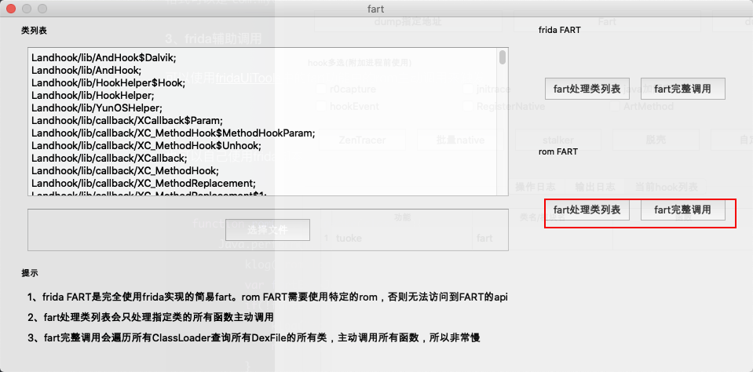
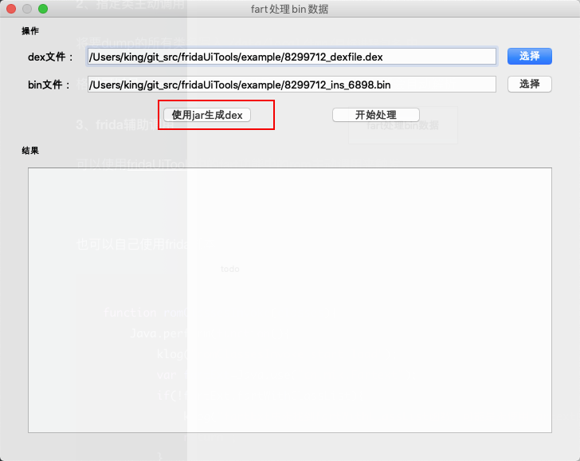
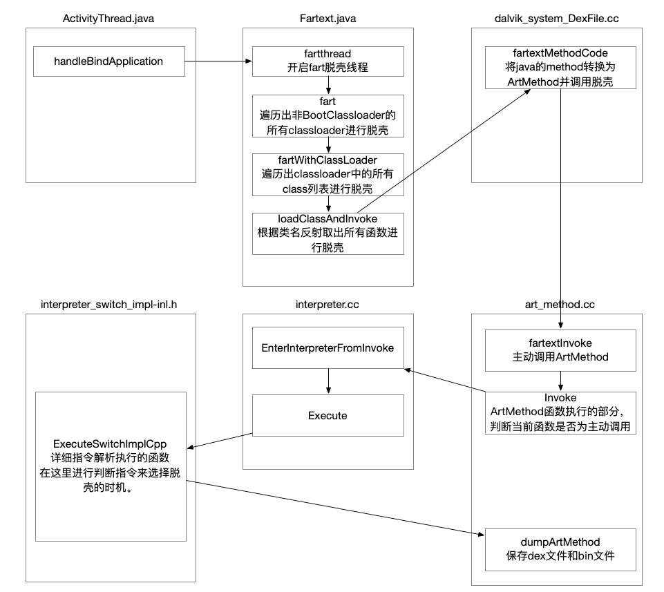

# FartExt
在FART的基础上进行优化并实现更深的主动调用，来实现脱抽取壳。适用AOSP10

本人的测试版本是android 10r2，测试手机是pixel3。如需其他版本，请自行编译。

编译的版本是sailfish  Pixel binaries for Android 10.0.0 (QP1A.191005.007.A1)

### 下载

链接: https://pan.baidu.com/s/1lgG8P3H2Q5B6e7rZr58cXw  密码: 033p

### 使用

**1、完整主动调用**

`echo "packageName" > /data/local/tmp/fext.config`

打开应用等待60秒后开始完整的主动调用。

`adb logcat |grep fartext`查看日志。出现`fart over`就是脱壳完成了

**2、指定类主动调用**

将要dump的所有类名写入`/data/local/tmp/目标进程包名`中。

格式可以是`com.myClass`也可以是`Lcom\myClass;`内部会自动解析

**3、frida辅助调用**

可以使用[fridaUiTools](https://github.com/dqzg12300/fridaUiTools)中的fart功能中的rom主动调用来触发

也可以自己使用frida脚本

~~~javascript
function romClassesInvoke(classes){
    Java.perform(function(){
        klog("romClassesInvoke start load");
        var fartExt=Java.use("cn.mik.Fartext");
        if(!fartExt.fartWithClassList){
            klog("fartExt中未找到fartWithClassList函数，可能是未使用Fartext的rom")
            return ;
        }
        fartExt.fartWithClassList(classes);
    })
}

function romFartAllClassLoader(){
    Java.perform(function(){
       var fartExt=Java.use("cn.mik.Fartext");
       if(!fartExt.fartWithClassLoader){
           klog("fartExt中未找到fartWithClassLoader函数，可能是未使用Fartext的rom");
           return;
       }
       Java.enumerateClassLoadersSync().forEach(function(loader){
           klog("romFartAllClassLoader to loader:"+loader);
           if(loader.toString().indexOf("BootClassLoader")==-1){
               klog("fart start loader:"+loader);
               fartExt.fartWithClassLoader(loader);
           }
       })
    });
}
~~~

**4、修复dex**

脱壳的结果是保存在`/sdcard/fext/目标进程包名`中

使用[dexfixer](https://github.com/dqzg12300/dexfixer)修复

`java -jar ./dexfixer.jar dexpath binpath outpath`

或者使用[fridaUiTools](https://github.com/dqzg12300/fridaUiTools)的辅助功能进行修复

**5、日志查看**

logcat搜索fartext即可搜到所有相关日志。

**6、流程图**

